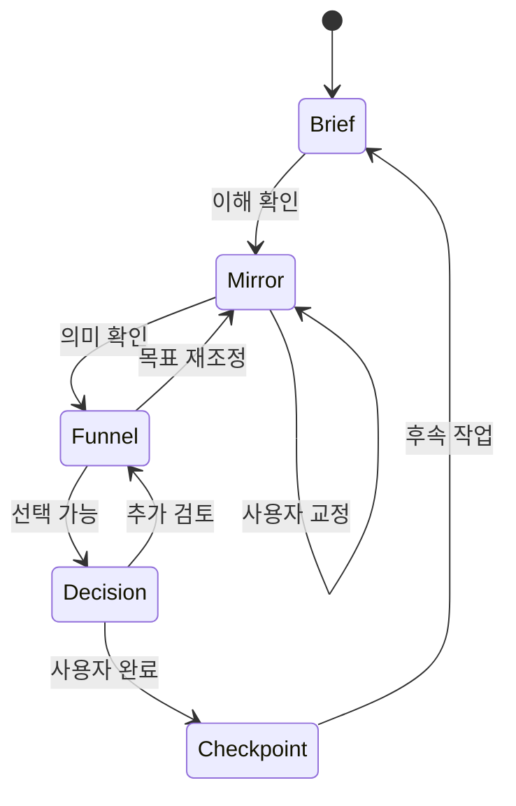

# ORBIT Dialogue Funnel — MVP Specification

> Version: SPEC v0.1
> Status: PROTOTYPE READY
> Product scope: local-first, single-user, one-work-item flow

## 1. 검증할 가설

사용자가 LLM과 작업할 때 목표·경계·완료 조건을 먼저 보이게 하고, LLM의 이해를 승인 또는 교정한 뒤 결과를 만들게 하면 다음 두 가지가 개선된다.

1. 매끄럽지만 목표에서 벗어난 첫 결과가 줄어든다.
2. 세션이 바뀌어도 선택 이유와 남은 차이를 다시 사용할 수 있다.

MVP는 이 가설을 검증한다. 범용 AI 작업공간의 완성도를 검증하지 않는다.

## 2. 사용자 흐름과 화면

### 화면 A — 새 작업 Brief

필수 입력은 최소화한다.

| 필드 | 필수 | 설명 |
|---|:---:|---|
| 작업 이름 | ✅ | 나중에 다시 찾을 짧은 이름 |
| 해결하려는 문제 | ✅ | 산출물이 아니라 해결할 문제 |
| 꼭 지킬 것 |  | 포함해야 할 가치·조건 |
| 하지 말아야 할 것 |  | 금지선·피해야 할 방향 |
| 제약 |  | 시간·비용·권한·환경 |
| 충분하다고 볼 조건 | ✅ | 문제 제기자가 완료를 판단할 기준 |
| 아직 모르는 것 |  | LLM이 임의로 채우지 않아야 할 빈자리 |

행동:

- `이해 확인으로 이동`
- `임시 저장`

### 화면 B — Mirror

LLM 또는 사용자가 가져온 응답을 다음 구조로 표시한다.

| 영역 | 사용자 행동 |
|---|---|
| 내가 이해한 목표 | 맞음 / 교정 |
| 우선순위 | 맞음 / 교정 |
| 경계와 제약 | 맞음 / 교정 |
| 완료 조건 | 맞음 / 교정 |
| 가정한 것 | 유지 / 제거 / 미결정 |
| 아직 모르는 것 | 질문 / 그대로 보존 |

사용자는 전체에 한 번 동의하지 않고 항목별로 확인한다. 최소 한 번의 확인 뒤에만 결과 단계로 이동한다.

행동:

- `교정 반영 후 다시 되말하기`
- `현재 이해로 첫 결과 진행`

### 화면 C — Funnel

첫 결과 또는 2~3개의 선택지를 표시하고 다음 질문을 고정한다.

- 원래 목표에 직접 기여하는가?
- 꼭 지킬 것을 보존했는가?
- 하지 말아야 할 것을 넘었는가?
- 유용하지만 지금은 필요 없는 확장은 무엇인가?
- 결과를 보고 새로 발견한 기준은 무엇인가?

각 항목은 `유지 / 수정 / 제거 / 보류`로 표시한다.

### 화면 D — Decision

| 필드 | 설명 |
|---|---|
| 현재 선택 | 선택하거나 승인한 결과 |
| 선택 이유 | 한 문장 이상 |
| 근거 종류 | FACT / CONSTRAINT / PREFERENCE / EXPERIENCE / INFERENCE / UNKNOWN |
| 선택하지 않은 대안 | 중요한 것만 |
| 제외 이유 | 왜 지금 선택하지 않았는가 |
| 남은 차이·반론 | 동의하지 않았지만 지우지 않을 내용 |
| 다시 검토할 조건 | 어떤 변화가 생기면 다시 열 것인가 |

사용자가 완료를 선택하면 시스템은 남은 미결정과 위험을 보여 주되 완료를 대신 거부하지 않는다.

### 화면 E — Checkpoint

다음 정보를 한 화면에 요약한다.

- 마지막으로 확인한 목표·경계·완료 조건
- 주요 교정 3개 이내
- 현재 선택과 근거
- 남은 차이와 위험
- 다음 행동 또는 재시작점
- 생성·수정 시간

행동:

- `Markdown 내보내기`
- `JSON 내보내기`
- `이 체크포인트에서 새 세션 시작`

## 3. 상태 모델



상태를 건너뛸 수는 있지만, Checkpoint에는 건너뛴 단계와 비어 있는 근거가 표시된다. 시스템은 빈자리를 자동으로 채워 완료된 것처럼 보이게 하지 않는다.

## 4. 최소 데이터 구조

```json
{
  "workItem": {
    "id": "local-id",
    "title": "",
    "problem": "",
    "mustKeep": [],
    "mustNot": [],
    "constraints": [],
    "doneWhen": [],
    "unknowns": []
  },
  "alignment": {
    "summary": "",
    "assumptions": [],
    "corrections": [],
    "confirmedAt": null
  },
  "decision": {
    "selected": "",
    "reasons": [],
    "alternatives": [],
    "remainingDifferences": [],
    "revisitWhen": []
  },
  "checkpoint": {
    "nextAction": "",
    "updatedAt": ""
  }
}
```

`reasons`의 각 항목은 `type`과 `text`를 가진다. `type`은 ORBIT의 여섯 근거 종류 중 하나다.

## 5. 기능 요구사항

### 반드시 포함

- 작업 생성·수정·삭제
- 단계별 자동 저장
- 항목별 확인과 교정 이력
- 근거 종류 선택
- 남은 차이·재검토 조건 기록
- Checkpoint 요약
- Markdown·JSON 내보내기와 JSON 다시 불러오기
- 브라우저 새로고침 뒤 로컬 데이터 복원

### 이번 MVP에서 제외

- 로그인·권한·팀 협업
- 서버 데이터베이스
- 외부 LLM API 자동 호출
- 자동 사실 검증
- 파일 첨부·검색·벡터 저장
- 알림·분석·결제

## 6. 수용 기준

1. 사용자는 빈 작업에서 10분 이내 첫 Checkpoint를 만들 수 있다.
2. 필수 필드가 비어 있으면 시스템은 빈 항목을 보여 주되 임의 값을 생성하지 않는다.
3. Mirror 교정 전후 내용이 모두 남는다.
4. Decision에는 최소 하나의 이유 또는 `UNKNOWN` 표시가 필요하다.
5. 완료 뒤에도 남은 차이와 위험이 삭제되지 않는다.
6. 내보낸 JSON을 다시 불러오면 모든 핵심 필드가 복원된다.
7. 내보낸 Markdown만 읽어도 다음 사용자가 목표·선택·다음 행동을 파악할 수 있다.

## 7. 프로토타입 검증 과제

다음 세 종류의 실제 작업으로 흐름을 시험한다.

1. 문서: 한 페이지 제안서 방향 정하기
2. 교육: 3차시 활동안에서 필수·제외 요소 선택하기
3. 개발: 작은 기능의 범위와 완료 조건 정하기

각 과제 뒤 다음을 기록한다.

- 사용하지 않은 필드
- 너무 늦게 등장한 질문
- 사용자가 답을 만들기 위해 억지로 채운 필드
- Checkpoint만으로 재개할 수 없었던 정보
- 일반 채팅보다 줄어든 재설명과 늘어난 입력 부담

## 8. 구현 전 결정 관문

종이 또는 클릭 프로토타입 3회에서 핵심 흐름이 유효하다고 판단된 뒤에만 기술 스택과 LLM 연동을 선택한다. 구현 결정에는 최소한 다음 대안을 비교한다.

- LLM 없이 기록 흐름만 제공
- 기존 LLM 대화에 붙는 보조 도구
- LLM API를 직접 연결한 독립 웹앱

현재 명세는 세 대안 중 하나를 미리 확정하지 않는다.
