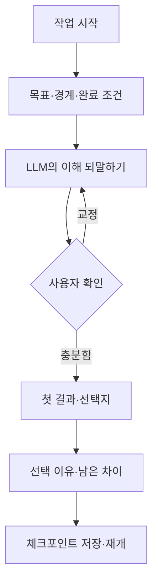

# ORBIT Product Track

> Version: DISCOVERY v0.1
> Status: ORIGINAL PROGRAM INTENT TO RECOVER
> Working name: ORBIT Dialogue Funnel (당시 임시 이름)
> Source baseline: `Genesis Document Set v1.0`

> 2026-10-04 교정: 아래의 ‘대화 조율 레이어’와 다섯 화면은 철학을 소프트웨어로 옮긴 당시의 **제안**이다. 사용자는 입력·정리 화면이 원래 만들려던 프로그램이 아니라고 명시했다. 구체적 작동 방식은 사용자에게 확인하기 전까지 확정하지 않는다. [교정 기록](../../decisions/CR-0030_Withdraw_Input_Form_Prototype.md).

## 이 트랙이 만드는 것

제품 트랙은 더 많은 답을 생성하는 새로운 채팅앱을 먼저 만들지 않는다. 사용자가 첫 결과 뒤에 목표와 경계를 확인하고, LLM의 해석을 교정하며, 선택의 이유와 남은 차이를 다음 작업에 가져갈 수 있게 하는 **대화 조율 레이어**를 실험한다.

## 사용자 문제 가설

> LLM의 답은 빠르고 풍부하지만, 사용자는 대화가 길어질수록 처음 목표와 경계가 어디에서 바뀌었는지 알기 어렵고 다음 작업에서는 같은 설명을 다시 시작한다.

초기 사용자는 문서 작성, 기획 또는 개발 작업에서 LLM과 여러 차례 수정 대화를 하는 개인 사용자다.

## 제품 약속

사용자는 대화를 시작하기 전에 완벽한 프롬프트를 작성하지 않아도 된다. 대신 제품은 중요한 순간마다 다음을 보이게 한다.

- 지금 해결하려는 목표
- 반드시 지킬 것과 넘지 말아야 할 경계
- LLM이 이해한 내용과 아직 모르는 것
- 사용자가 교정한 부분
- 선택한 안과 선택하지 않은 대안
- 완료를 판단할 조건과 남은 차이

## 제품이 아닌 것

- 모든 LLM 기능을 대신하는 범용 채팅 서비스
- 자동으로 사용자의 진짜 의도를 알아내는 시스템
- 사용자를 대신해 최종 결정을 내리는 추천 엔진
- 모든 대화를 장문의 기록으로 강제하는 프로젝트 관리 도구
- LLM에게 사람과 같은 기억이나 책임이 있다고 전제하는 제품

## 핵심 사용 흐름

## MVP의 다섯 순간

1. **Brief** — 사용자가 목표, 필수 조건, 금지선, 제약과 완료 조건을 짧게 적는다.
2. **Mirror** — LLM은 결과를 만들기 전에 이해한 내용, 가정과 모르는 것을 되말한다.
3. **Funnel** — 사용자는 맞음·어긋남·미결정을 표시하고 불필요한 가능성을 덜어낸다.
4. **Decision** — 결과 또는 선택지에서 하나를 고르고 근거 종류, 제외 대안과 남은 반론을 남긴다.
5. **Checkpoint** — 다음 대화가 처음부터 시작되지 않도록 Markdown·JSON 기록을 저장한다.

## 첫 구현 경계

[MVP 명세](MVP_SPEC.md)는 다음 범위로 제한한다.

- 개인용 단일 작업
- 계정 없는 로컬 우선 웹앱
- 수동 입력 또는 사용자가 가져온 LLM 응답
- Brief → Mirror → Funnel → Decision → Checkpoint의 한 흐름
- Markdown과 JSON 내보내기

첫 버전에서는 다음을 만들지 않는다.

- 다중 사용자 협업
- 클라우드 동기화와 계정
- 여러 LLM 공급자 자동 연결
- 자동 장기 기억과 개인 프로필 추론
- 프로젝트 관리, 일정, 결제와 공개 공유

## 제품 성공 기준

기능 수나 생성 문장 품질보다 다음 행동 변화를 본다.

1. 사용자가 첫 결과 전에 목표와 완료 조건을 확인하는가?
2. LLM의 해석에서 어긋난 부분을 구체적으로 교정하는가?
3. 선택 이유와 제외 대안이 체크포인트에 남는가?
4. 다음 세션에서 이전 체크포인트를 실제로 재사용하는가?
5. 기록 입력 때문에 일반 채팅보다 작업이 지나치게 느려지지 않는가?

## 검증 순서

1. 종이 화면 또는 Markdown 양식으로 3개 실제 작업을 수행한다.
2. 각 단계에서 사용하지 않은 입력과 빠진 질문을 표시한다.
3. 클릭 프로토타입으로 단계 이동과 수정 흐름을 검증한다.
4. 로컬 웹앱으로 저장·불러오기·내보내기를 구현한다.
5. 실제 LLM 연결은 흐름이 유효한 뒤 별도로 결정한다.

## 아직 결정하지 않은 것

- 실제 제품명과 공개 여부
- 대상 작업을 문서·기획·개발 중 어디에 먼저 제한할지
- 사용할 프론트엔드 기술과 LLM 연결 방식
- 브라우저 저장 이후의 동기화·보안 모델
- 유료화, 배포와 운영 주체

이 결정은 종이·클릭 프로토타입에서 대화 흐름의 가치가 확인된 뒤 내린다.
